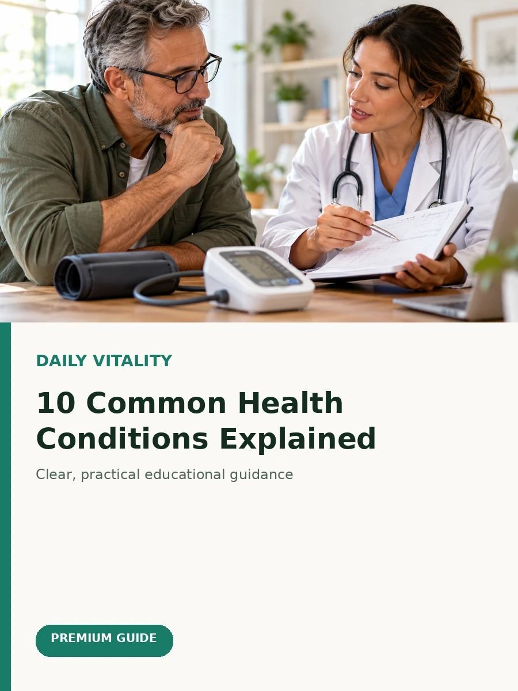

# Daily Vitality — index.html patch (2 fixes)

## FIX 1 — replace the 2 duplicate-cover thumbnails

In your `index.html`, find these two lines and replace the `src="..."` as shown.
(Both currently use the same generic file, exactly the bug reported.)

**Card 1 — Understanding Your Body's Hunger Cues**
Find:
```html

```
Replace with:
```html

```

**Card 2 — Mindful Eating vs. Dieting**
Find:
```html

```
Replace with:
```html

```

## FIX 2 — add the 14 orphaned articles so they go live

These files already exist in your GitHub repo but have NO link anywhere in `index.html`,
so nobody can reach them on the live site even though they're uploaded.

Open `index.html`, find this exact line:
```html
<!-- WAFADAR_INDEX_ARTICLES_AUTO -->
```
and paste the entire contents of `new-article-cards.html` (in this same zip) directly
after that line.

**IMPORTANT — please check before publishing:**
I could not open each of these 14 files' actual content this session (a tool
limitation), so their category tag, date, and description below are my
*best guess from the filename only* — not read from the real article text.
Please skim each one and correct the category/description if my guess is off
before you commit. The title-casing is also just derived from the filename.

One file — `homepage-redesign.html` — looks like a design draft, not an article,
so I left it OUT of the new cards. Let me know if it should actually be published
as an article or if it's something else (e.g. an alternate homepage layout you were
testing) and I'll handle it differently.

## After pasting both fixes
Commit `index.html` to your repo (`ah2093334-bit/daily-vitality`) and the site
will update automatically via GitHub Pages within a minute or two.
